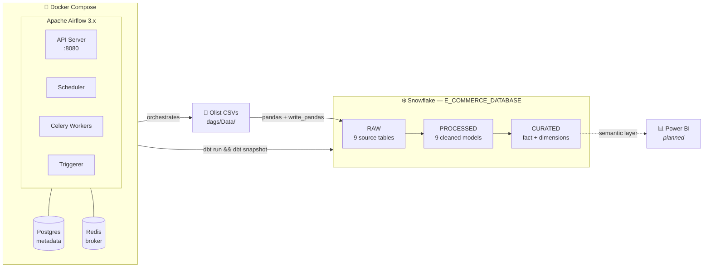

# 🛒 E-Commerce Data Warehouse & Analytics Pipeline

**A containerized, end-to-end ELT pipeline that lands the Olist Brazilian e-commerce dataset in Snowflake, models it into analytics-ready dimensional marts with dbt, and orchestrates every run with Apache Airflow.**

<p align="center">
  
  
  
  
  
  
</p>

<p align="center">
  
  
  
</p>

---

## 📖 Table of Contents

- [Project Description](#-project-description)
- [Architecture & Data Flow](#️-architecture--data-flow)
- [Key Engineering & Modeling Decisions](#-key-engineering--modeling-decisions)
- [Project Directory Structure](#-project-directory-structure)
- [Prerequisites & Environment Setup](#️-prerequisites--environment-setup)
- [Running the Project Locally](#-running-the-project-locally)
- [dbt Transformation Workflow](#-dbt-transformation-workflow)
- [Roadmap](#️-roadmap)
- [Contributing](#-contributing)
- [License](#-license)

---

## 📌 Project Description

This project implements a production-shaped **ELT data warehouse** on the modern data stack, built around the [Olist Brazilian E-Commerce public dataset](https://www.kaggle.com/datasets/olistbr/brazilian-ecommerce) — roughly 100k orders spanning customers, sellers, products, order items, payments, reviews and geolocation records.

The pipeline follows the **extract-load-transform** pattern rather than classic ETL: raw CSV extracts are loaded into Snowflake untouched, and every transformation happens in-warehouse as versioned SQL managed by dbt. That choice pushes compute onto Snowflake's elastic warehouse, keeps the raw layer replayable, and makes the entire business logic reviewable in git.

**What the pipeline does, end to end:**

1. **Ingests** nine source entities from CSV into the Snowflake `RAW` schema using the Snowflake Python connector and `write_pandas` for bulk loading. Each entity is wrapped in its own Airflow task group with an idempotent truncate-then-load pattern, so a rerun never produces duplicates.
2. **Standardizes** the raw layer into a `processed` schema — casing normalization, date typing, null coalescing, category-name cleanup, and geolocation deduplication — one model per source table.
3. **Models** the processed layer into a `curated` star schema: a central `fact_e_commerce` grain of one row per order item, joined to order-detail and review dimensions, plus four **SCD Type 2 dimensions** built as dbt snapshots that preserve the full change history of customers, sellers, products and payments.
4. **Orchestrates** the whole thing hourly through an Airflow DAG that fans out across all nine ingestion task groups in parallel, then fans back in to a single dbt execution step.
5. **Runs anywhere** — the entire stack (Airflow scheduler, API server, workers, triggerer, Postgres metadata DB, Redis broker) is defined in Docker Compose, so a fresh clone is a single command away from a running pipeline.

**Why it scales:** ingestion is metadata-driven — adding a tenth source table means appending one string to a list, and the DAG generates the task group automatically. Transformation is declarative, so dbt resolves the dependency graph itself and parallelizes model execution. And because storage and compute are decoupled in Snowflake, growing from 100k orders to 100M is a warehouse-size change, not a rewrite.

---

## 🏗️ Architecture & Data Flow


Docker Compose runs the Airflow cluster. Airflow orchestrates Python ingestion into Snowflake, then triggers dbt, which executes transformations **inside** Snowflake — dbt itself only compiles and dispatches SQL; no data ever moves through the dbt process.



### Airflow DAG topology

The DAG `e_commerece_dag` runs on an hourly cron (`0 * * * *`). All nine ingestion task groups execute **in parallel** between the `start` and `dbt_run` boundaries:

```
                    ┌── customers_task_group ──────┐
                    │     delete_data → load       │
                    ├── products_task_group ───────┤
                    ├── category_name_task_group ──┤
                    ├── geolocation_task_group ────┤
  start ────────────┼── order_items_task_group ────┼──────→ dbt_run ────→ end
 (Empty)            ├── order_payments_task_group ─┤     (Bash: dbt run    (Empty)
                    ├── order_reviews_task_group ──┤      && dbt snapshot)
                    ├── orders_task_group ─────────┤
                    └── sellers_task_group ────────┘
```


Each task group is a two-step unit:

| Task | Operator | Responsibility |
|---|---|---|
| `{table}_delete_data` | `PythonOperator` | `DELETE FROM {TABLE}` — clears the raw target so the load is idempotent |
| `{table}_from_csv_to_snowflake` | `PythonOperator` | Reads `olist_{table}_dataset.csv` with pandas, upper-cases columns, bulk-loads via `write_pandas` |
| `dbt_run` | `BashOperator` | `cd /opt/airflow/dags/e_commerce_dbt && dbt run && dbt snapshot` |

### Warehouse layer design

```
E_COMMERCE_DATABASE
│
├── RAW              ← landed as-is from CSV; DDL in "SQL Queries/Objects Creation.sql"
│                      customers · products · category_name · geolocation · order_items
│                      order_payments · order_reviews · orders · sellers
│
├── PROCESSED        ← dbt models, materialized as tables
│                      type casting, INITCAP/UPPER normalization, COALESCE on nullable
│                      review fields, geolocation collapsed to one row per zip prefix
│
├── CURATED          ← dbt models, materialized as tables
│                      fact_e_commerce · dim_order_details · dim_reviews
│
└── RAW_CURATED      ← dbt snapshots (SCD Type 2, `check` strategy)
                       dim_customers · dim_sellers · dim_products · dim_payments
```

---

## 🧭 Key Engineering & Modeling Decisions

The most consequential modeling call in this project concerns geography. It is documented here because the "obvious" design — a single conformed `dim_geolocation` — is actively wrong for this dataset, and anyone reading the models will otherwise wonder why it's missing.

<details open>
<summary><b>🌍 The Olist Geolocation Challenge — why there is no shared <code>dim_geolocation</code></b></summary>

<br/>

### The problem

Olist's `geolocation` table is keyed on `geolocation_zip_code_prefix`, the first five digits of a Brazilian CEP postal code. The instinct is to treat this as a natural key and build one conformed geography dimension that both `dim_customer` and `dim_seller` point at.

That instinct breaks on contact with the data. **`zip_code_prefix` is not unique.** The raw table holds roughly a million rows for about nineteen thousand distinct prefixes, and a single prefix routinely maps to:

- **Multiple distinct city names** — including genuine municipal boundaries that share a prefix, plus spelling variants, accent inconsistencies, and outright misspellings of the same city.
- **Hundreds of distinct lat/lng pairs** — the coordinates are per-address geocodes, not a prefix centroid.
- **Occasionally conflicting state codes** on the same prefix.

A naive join from `processed_customers` to a prefix-keyed dimension is therefore a **many-to-many fan-out**: every customer row multiplies by the number of geolocation rows sharing its prefix. Any fact table built downstream inherits that multiplication, and revenue silently inflates.

### Options considered

| Option | Why it was rejected |
|---|---|
| Conformed `dim_geolocation` on raw prefix | Fans out facts; prefix is not a unique key. |
| Prefix + city + state composite key | Still ambiguous — misspellings create phantom dimension members, and customers/sellers carry their *own* city spelling that won't match. |
| Arbitrary dedup to one row per prefix, then join | Silently overrides the city and state the customer record actually asserts, in favour of whichever geolocation row won the tiebreak. Destroys source fidelity. |
| **Role-specific geographic attributes** ✅ | Chosen. See below. |

### The decision

**Geographic attributes are modeled as role-specific columns on the dimensions that own them, not as a shared conformed dimension.**

`dim_customers` carries `customer_zip_code_prefix`, `customer_city` and `customer_state`. `dim_sellers` carries `seller_zip_code_prefix`, `seller_city` and `seller_state`. Each is sourced from that entity's own record — the customer's declared city, the seller's declared city — with normalization applied (`INITCAP` on city, `UPPER` on state) but no substitution from an external geography table.

This is the classic Kimball **role-playing** situation: "customer location" and "seller location" are semantically different roles, and in this dataset they cannot be reconciled to a single trustworthy member without fabricating data.

`processed_geolocation` is still built and maintained as a **standalone reference model**, not as a join target. It collapses the raw table to exactly one row per prefix by averaging latitude and longitude across the prefix (window `AVG(...) OVER (PARTITION BY geolocation_zip_code_prefix)`) and selecting the first row per partition. That gives a usable approximate centroid for **map visualizations and distance calculations**, deliberately kept out of the fact join path where its ambiguity would corrupt aggregates.

### The tradeoff, stated plainly

- **Accepted cost:** city and state strings are denormalized onto two dimensions, so a city rename would require updating both. Cross-role geographic rollups ("all activity in São Paulo") need a `UNION` or a conformed lookup built at query time.
- **Bought benefit:** fact grain is preserved exactly. No fan-out, no inflated revenue, no fabricated geography. Every location attribute traces back to the source record that asserted it.

**Integrity over normalization.** A normalized model that produces wrong numbers is worse than a denormalized model that produces right ones.

</details>

<details>
<summary><b>🔁 Why SCD Type 2 snapshots instead of plain dimension models</b></summary>

<br/>

`dim_customers`, `dim_sellers`, `dim_products` and `dim_payments` are built as **dbt snapshots** rather than ordinary models, using the `check` strategy against explicitly listed columns:

| Snapshot | Unique key | Tracked columns |
|---|---|---|
| `dim_customers` | `customer_id` | zip prefix, city, state |
| `dim_sellers` | `seller_id` | zip prefix, city, state |
| `dim_products` | `product_id` | category name |
| `dim_payments` | surrogate key of `order_id` + `payment_sequential` | payment type, installments |

The `check` strategy is used rather than `timestamp` because the Olist source has no reliable per-row modification timestamp. dbt therefore compares the listed columns against the stored version and writes a new row with `dbt_valid_from` / `dbt_valid_to` only when something actually changed.

This is why `dbt snapshot` runs **after** `dbt run` in the DAG: snapshots read from the `processed` models, so those must exist and be current first.

</details>

<details>
<summary><b>🧱 Why truncate-and-load instead of incremental ingestion</b></summary>

<br/>

Each ingestion task group runs `DELETE FROM {TABLE}` before loading. This makes the raw layer **fully idempotent** — a failed or retried DAG run cannot leave partial or duplicated rows, and the raw layer is always an exact mirror of the current source extract.

For a static ~100k-order dataset the full-refresh cost is negligible, and the correctness guarantee is worth more than the compute saved. The history that matters is captured downstream by the SCD Type 2 snapshots, not by accumulating rows in raw.

**When this would change:** at production volume, this becomes the first thing to replace — with Snowflake `COPY INTO` from an external stage plus a `MERGE`, or incremental dbt models keyed on a watermark column.

</details>

---

## 📁 Project Directory Structure

```
E-Commerce-Data-Warehouse-Analytics-Pipeline/
│
├── dags/                               # Mounted to /opt/airflow/dags in every container
│   ├── E_commerece_dag.py              # DAG definition — dynamic task groups + dbt step
│   ├── Utilities.py                    # Snowflake connection, read/load/delete helpers
│   ├── Data/                           # Olist source CSVs (9 files)
│   │   ├── olist_customers_dataset.csv
│   │   ├── olist_orders_dataset.csv
│   │   ├── olist_order_items_dataset.csv
│   │   └── ...
│   │
│   └── e_commerce_dbt/                 # The dbt project (lives inside dags/ so workers can reach it)
│       ├── dbt_project.yml             # Materializations + target schemas per layer
│       ├── profiles.yml                # Snowflake connection profile
│       ├── packages.yml                # dbt_utils >= 1.3.0
│       │
│       ├── models/
│       │   ├── sources.yml             # Declares the 9 RAW tables as dbt sources
│       │   │
│       │   ├── processed/              # Layer 1 — cleaned & standardized (materialized: table)
│       │   │   ├── processed_customers.sql
│       │   │   ├── processed_sellers.sql
│       │   │   ├── processed_products.sql
│       │   │   ├── processed_category_name.sql
│       │   │   ├── processed_geolocation.sql      # Prefix centroid — reference only
│       │   │   ├── processed_orders.sql
│       │   │   ├── processed_order_items.sql
│       │   │   ├── processed_order_payments.sql
│       │   │   └── processed_order_reviews.sql
│       │   │
│       │   └── curated/                # Layer 2 — analytics-ready (materialized: table)
│       │       ├── fact_e_commerce.sql        # Grain: one row per order item
│       │       ├── dim_order_details.sql      # Order lifecycle dates + delay flag
│       │       └── dim_reviews.sql
│       │
│       ├── snapshots/curated/          # SCD Type 2 dimensions → raw_curated schema
│       │   ├── dim_customers.sql
│       │   ├── dim_sellers.sql
│       │   ├── dim_products.sql
│       │   └── dim_payments.sql
│       │
│       ├── macros/                     # Reserved for custom Jinja macros
│       ├── tests/                      # Reserved for singular data tests
│       ├── seeds/                      # Reserved for static reference CSVs
│       └── analyses/                   # Ad-hoc analytical SQL (not materialized)
│
├── SQL Queries/
│   └── Objects Creation.sql            # Snowflake DDL — database, RAW schema, 9 tables with PK/FK
│
├── config/
│   └── airflow.cfg                     # Airflow config, mounted to /opt/airflow/config
│
├── logs/                               # Airflow task logs (bind-mounted, gitignored)
│
├── Dockerfile                          # Extends apache/airflow, installs dbt-snowflake
├── docker-compose-airflow.yaml         # Full stack: apiserver, scheduler, worker, triggerer,
│                                       #   dag-processor, postgres, redis, flower (opt-in)
├── requirements.txt                    # dbt-snowflake, snowflake, snowflake-connector-python
├── .env                                # Local secrets — NOT committed (see setup below)
└── LICENSE                             # MIT
```

**Key directories at a glance**

| Path | Purpose |
|---|---|
| `dags/` | Everything Airflow needs. Bind-mounted into all containers, so edits are picked up without a rebuild. |
| `dags/e_commerce_dbt/models/processed/` | One model per source table. Cleaning only — no joins, no business logic. |
| `dags/e_commerce_dbt/models/curated/` | Joins and business logic. This is what BI tools query. |
| `dags/e_commerce_dbt/snapshots/` | History-tracking dimensions. Run separately from models via `dbt snapshot`. |
| `SQL Queries/` | One-time warehouse bootstrap. Run manually in a Snowflake worksheet before the first DAG run. |

---

## ⚙️ Prerequisites & Environment Setup

### Required tools

| Tool | Minimum version | Notes |
|---|---|---|
| Docker Engine | 20.10+ | |
| Docker Compose | v2 | Bundled with Docker Desktop |
| Snowflake account | — | Trial tier is sufficient |
| Git | any | |
| RAM allocated to Docker | **4 GB minimum, 8 GB recommended** | The Celery stack runs six containers |

> Python and dbt do **not** need to be installed on the host. Both live inside the Airflow image, built from `requirements.txt`.

### Step 1 — Clone the repository

```bash
git clone https://github.com/OmarGamalH/E-Commerce-Data-Warehouse-Analytics-Pipeline.git
cd E-Commerce-Data-Warehouse-Analytics-Pipeline
```

### Step 2 — Bootstrap the Snowflake warehouse

Open a Snowflake worksheet and execute `SQL Queries/Objects Creation.sql`. This creates `E_COMMERCE_DATABASE`, the `RAW` schema, and all nine typed tables with their primary and foreign key constraints.

### Step 3 — Configure your environment

Create a `.env` file in the project root:

```bash
# ─── Airflow runtime ──────────────────────────────────────────────
# On Linux/macOS set this to your user id so bind-mounted files stay writable
AIRFLOW_UID=50000

# Generate with:
#   python -c "from cryptography.fernet import Fernet; print(Fernet.generate_key().decode())"
FERNET_KEY=<your-generated-fernet-key>

AIRFLOW__API_AUTH__JWT_SECRET=<random-string>
AIRFLOW__API_AUTH__JWT_ISSUER=airflow

# Airflow web UI admin account
_AIRFLOW_WWW_USER_USERNAME=airflow
_AIRFLOW_WWW_USER_PASSWORD=<choose-a-password>

# ─── Snowflake connection ─────────────────────────────────────────
SNOWFLAKE_ACCOUNT=<org>-<account>        # e.g. abcdefg-hi12345
SNOWFLAKE_USER=<your-username>
SNOWFLAKE_PASSWORD=<your-password>
SNOWFLAKE_ROLE=ACCOUNTADMIN
SNOWFLAKE_WAREHOUSE=COMPUTE_WH
SNOWFLAKE_DATABASE=E_COMMERCE_DATABASE
SNOWFLAKE_SCHEMA=RAW
```

Generate a Fernet key:

```bash
python -c "from cryptography.fernet import Fernet; print(Fernet.generate_key().decode())"
```

> [!IMPORTANT]
> **Never commit `.env` or hard-code credentials.** Add `.env` to `.gitignore` before your first commit. Both `dags/Utilities.py` and `dags/e_commerce_dbt/profiles.yml` should read from environment variables — `os.environ["SNOWFLAKE_PASSWORD"]` in Python, and `{{ env_var('SNOWFLAKE_PASSWORD') }}` in the dbt profile. If credentials have already been committed, rotate them and scrub the git history before publishing.

Example `profiles.yml` using environment variables:

```yaml
e_commerce_dbt:
  target: dev
  outputs:
    dev:
      type: snowflake
      account:   "{{ env_var('SNOWFLAKE_ACCOUNT') }}"
      user:      "{{ env_var('SNOWFLAKE_USER') }}"
      password:  "{{ env_var('SNOWFLAKE_PASSWORD') }}"
      role:      "{{ env_var('SNOWFLAKE_ROLE') }}"
      warehouse: "{{ env_var('SNOWFLAKE_WAREHOUSE') }}"
      database:  "{{ env_var('SNOWFLAKE_DATABASE') }}"
      schema:    "{{ env_var('SNOWFLAKE_SCHEMA') }}"
      threads: 4
```

### Step 4 — Add the source data

Download the [Olist dataset from Kaggle](https://www.kaggle.com/datasets/olistbr/brazilian-ecommerce) and place all nine CSVs in `dags/Data/`. Filenames must match the `olist_{entity}_dataset.csv` convention — the ingestion helper builds paths from the table name.

---

## 🚀 Running the Project Locally

### 1. Initialize the Airflow metadata database

First run only. This applies migrations and creates the admin user.

```bash
docker compose -f docker-compose-airflow.yaml up airflow-init
```

### 2. Build and start the stack

```bash
docker compose -f docker-compose-airflow.yaml up -d --build
```

The `--build` flag is needed on first run (and after any change to `requirements.txt`) so the custom image installs `dbt-snowflake`.

### 3. Verify everything is healthy

```bash
docker compose -f docker-compose-airflow.yaml ps
```

All services should report `healthy` or `running`. Give it 60–90 seconds on first boot.

### 4. Open the Airflow UI

Navigate to **[http://localhost:8080](http://localhost:8080)** and log in with the credentials from your `.env`.

### 5. Install dbt packages

`dbt_utils` is required by the `dim_payments` snapshot. Install it once inside the worker:

```bash
docker compose -f docker-compose-airflow.yaml exec airflow-worker \
  bash -c "cd /opt/airflow/dags/e_commerce_dbt && dbt deps"
```

### 6. Trigger the pipeline

Find **`e_commerece_dag`** in the DAG list, unpause it with the toggle, then hit **Trigger DAG** (▶) to run immediately. Otherwise it fires on the hour.

Switch to the **Graph** view to watch the nine task groups execute in parallel before converging on `dbt_run`.

To trigger from the CLI instead:

```bash
docker compose -f docker-compose-airflow.yaml exec airflow-worker \
  airflow dags trigger e_commerece_dag
```

### 7. Verify the results in Snowflake

```sql
USE DATABASE E_COMMERCE_DATABASE;

SELECT COUNT(*) FROM RAW.ORDERS;                 -- ~99,441
SELECT COUNT(*) FROM PROCESSED.PROCESSED_ORDERS;
SELECT * FROM CURATED.FACT_E_COMMERCE LIMIT 10;
SELECT * FROM RAW_CURATED.DIM_CUSTOMERS LIMIT 10;
```

### Useful operational commands

```bash
# Tail logs for a single service
docker compose -f docker-compose-airflow.yaml logs -f airflow-scheduler

# Open a shell in the worker (where dbt lives)
docker compose -f docker-compose-airflow.yaml exec airflow-worker bash

# Enable the Flower queue monitor at :5555
docker compose -f docker-compose-airflow.yaml --profile flower up -d

# Stop the stack, preserving the metadata database
docker compose -f docker-compose-airflow.yaml down

# Full teardown including volumes
docker compose -f docker-compose-airflow.yaml down -v
```

---

## 🔧 dbt Transformation Workflow

### Modeling approach

The project uses a **two-layer model architecture** plus a snapshot layer, configured in `dbt_project.yml`:

| Layer | Directory | Materialization | Target schema | Responsibility |
|---|---|---|---|---|
| **Processed** | `models/processed/` | `table` | `PROCESSED` | One model per source table. Casing normalization, date casting, null handling, deduplication. No joins, no business logic. |
| **Curated** | `models/curated/` | `table` | `CURATED` | Joins and business rules. Facts and non-historized dimensions. This is the BI-facing layer. |
| **Snapshots** | `snapshots/curated/` | snapshot | `RAW_CURATED` | SCD Type 2 dimensions with `dbt_valid_from` / `dbt_valid_to` history. |

Every layer boundary is enforced by dbt's `ref()` / `source()` graph — processed models read only from `source()`, curated models read only from `ref()`. dbt resolves execution order from that graph automatically.

### The curated star schema

```
                 dim_products (SCD2)
                        │
 dim_customers (SCD2) ──┼── fact_e_commerce ──┬── dim_reviews
                        │   grain: order item │
   dim_sellers (SCD2) ──┘                     └── dim_order_details
                        │
                 dim_payments (SCD2)
```

`fact_e_commerce` holds the foreign keys (`order_id`, `product_id`, `seller_id`, `customer_id`, `review_id`) alongside the additive measures `price` and `freight_value`. `dim_order_details` carries the full order lifecycle — purchase, approval, carrier handoff, delivery, estimated delivery — plus a derived `is_shipping_limit_delayed` flag computed from multi-item shipping windows.

### Running dbt manually

All commands run from inside the worker container, in the dbt project directory:

```bash
docker compose -f docker-compose-airflow.yaml exec airflow-worker bash
cd /opt/airflow/dags/e_commerce_dbt
```

| Command | What it does |
|---|---|
| `dbt debug` | Validates the Snowflake connection and profile |
| `dbt deps` | Installs packages from `packages.yml` |
| `dbt run` | Builds all processed + curated models |
| `dbt snapshot` | Applies SCD Type 2 changes to the four dimensions |
| `dbt test` | Executes all data tests |
| `dbt build` | `run` + `test` + `snapshot` + `seed`, in dependency order |
| `dbt docs generate && dbt docs serve` | Builds and serves the lineage documentation site |

Targeted runs with node selection:

```bash
# Rebuild one model and everything downstream of it
dbt run --select processed_customers+

# Rebuild only the curated layer
dbt run --select curated.*

# Rebuild a model and its upstream dependencies
dbt run --select +fact_e_commerce
```

> The DAG's `dbt_run` task executes `dbt run && dbt snapshot` in sequence. Once the test suite lands (see Roadmap), this becomes a single `dbt build`.

---

## 🗺️ Roadmap

### ✅ Delivered

- [x] Snowflake warehouse bootstrap with typed DDL and referential constraints
- [x] Metadata-driven CSV → Snowflake ingestion with idempotent task groups
- [x] Nine processed-layer cleaning models
- [x] Curated star schema: fact table + order-detail and review dimensions
- [x] Four SCD Type 2 dimensions via dbt snapshots
- [x] Hourly Airflow orchestration with parallel fan-out
- [x] Fully containerized stack via Docker Compose

### 🚧 In progress — Automated data quality

Data quality is currently enforced only by Snowflake's DDL constraints. The next milestone adds a proper testing layer:

- [ ] **Schema tests** — `unique` and `not_null` on every primary key; `relationships` from `fact_e_commerce` to each dimension; `accepted_values` on `order_status` and `payment_type`
- [ ] **`dbt_utils` tests** — `unique_combination_of_columns` on composite grains, `accepted_range` on `price` and `freight_value`, `expression_is_true` for lifecycle date ordering
- [ ] **Singular tests** — custom SQL in `tests/` asserting no order-item fan-out and no negative revenue
- [ ] **Soda Core integration** — freshness, volume anomaly, and distribution checks on the raw layer, running as a pre-ingestion Airflow task
- [ ] Promote the DAG's `dbt_run` step to `dbt build` so tests gate the curated layer

### 📊 Planned — Power BI semantic layer

- [ ] DirectQuery / Import connection from Power BI to the `CURATED` schema
- [ ] Semantic model with defined relationships and a proper date table
- [ ] DAX measure library — Total Revenue, Order Count, Average Order Value, Units Sold, On-Time Delivery Rate, Review Score Average
- [ ] Executive dashboard: revenue trend, category performance, top sellers, delivery SLA tracking, review sentiment distribution
- [ ] Geographic analysis page using `processed_geolocation` centroids, with role-specific customer and seller map layers

### 🔭 Future considerations

- [ ] Replace truncate-and-load with `COPY INTO` from an external stage plus incremental `MERGE`
- [ ] Add a conformed `dim_date` with fiscal calendar attributes
- [ ] CI pipeline running `dbt build` against a dedicated CI schema on every pull request
- [ ] Migrate secrets from `.env` to Airflow Connections backed by a secrets manager
- [ ] Replace the `BashOperator` dbt step with Cosmos, exposing each dbt model as a discrete Airflow task

---

## 🤝 Contributing

Contributions, issues and feature requests are welcome.

1. Fork the repository
2. Create a feature branch — `git checkout -b feature/your-feature`
3. Commit your changes — `git commit -m "Add your feature"`
4. Push the branch — `git push origin feature/your-feature`
5. Open a Pull Request

**Before submitting:**

- Run `dbt build` locally and confirm all models compile and tests pass
- Follow the existing naming conventions — `processed_*` for the cleaning layer, `dim_*` / `fact_*` for curated
- Add schema tests for any new model
- Never commit credentials, `.env` files, `logs/`, `target/`, or `dbt_packages/`

---

## 📄 License

Distributed under the **MIT License**. See [`LICENSE`](LICENSE) for the full text.

---

<p align="center">
  Built by <a href="https://github.com/OmarGamalH">Omar Gamal</a> · Data on the <a href="https://www.kaggle.com/datasets/olistbr/brazilian-ecommerce">Olist Brazilian E-Commerce</a> public dataset
</p>
